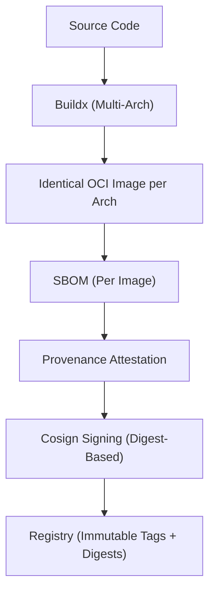

# Factory

BOM OCI-image library and builder

## Manual build of any image

```bash
docker buildx build \
  --platform linux/amd64,linux/arm64 \
  --provenance=true \
  --sbom=true \
  --attest type=provenance,mode=max \
  --build-arg IMAGE_SOURCE="https://github.com/bill-of-materials/factory" \
  --build-arg IMAGE_REVISION="$(git rev-parse HEAD)" \
  --build-arg IMAGE_CREATED="$(date -u +%Y-%m-%dT%H:%M:%SZ)" \
  -t ghcr.io/bill-of-materials/$(dirname):$(git rev-parse --short HEAD) \
  -t ghcr.io/bill-of-materials/$(dirname):latest \
  .
```

## Supply-chain architecture


