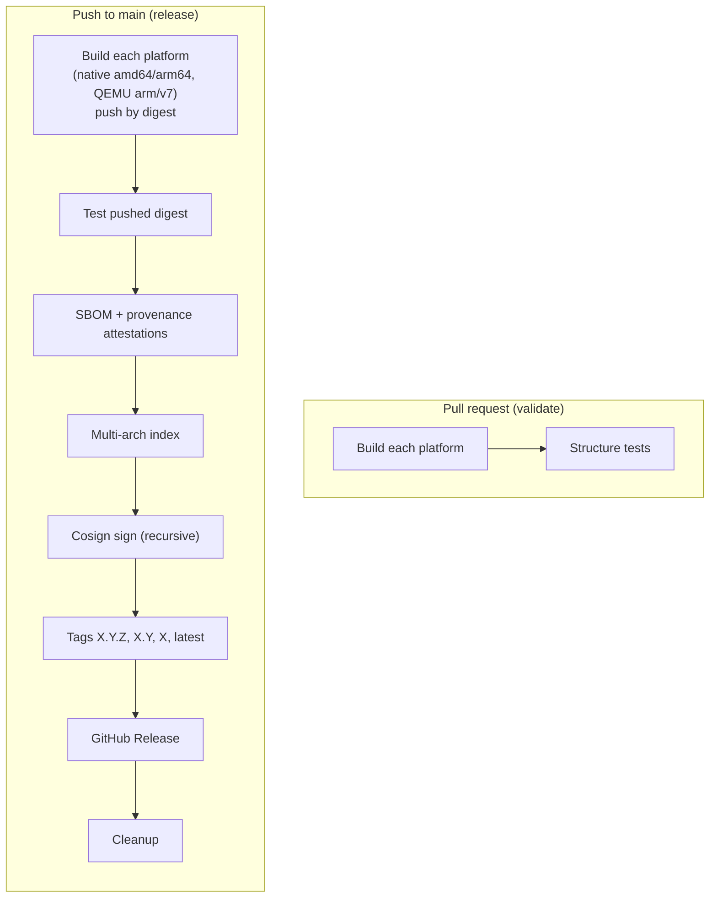

# Factory

BOM OCI-image library and builder

## Images

| Image | Description | Application | Platforms | Links |
| --- | --- | --- | --- | --- |
| `alpine3` | Hardened Alpine 3 base image with a non-root app user, dumb-init, curl and CA certificates. | — | amd64, arm64, arm/v7 | [Package](https://github.com/orgs/bill-of-materials/packages/container/package/alpine3), [Releases](https://github.com/bill-of-materials/factory/releases?q=alpine3) |
| `debian13-slim` | Hardened Debian 13 (trixie) slim base image with a non-root app user, dumb-init, curl and CA certificates. | — | amd64, arm64, arm/v7 | [Package](https://github.com/orgs/bill-of-materials/packages/container/package/debian13-slim), [Releases](https://github.com/bill-of-materials/factory/releases?q=debian13-slim) |
| `ninjam` | NINJAM server (ninjamsrv) built from source on the alpine3 base image. | ninjam <!-- renovate: datasource=git-refs depName=https://github.com/justinfrankel/ninjam branch=main digest=f4c0eff3a1d8d5f3ead470d0c7405c3ee37da24e -->`f4c0eff` | amd64 | [Package](https://github.com/orgs/bill-of-materials/packages/container/package/ninjam), [Releases](https://github.com/bill-of-materials/factory/releases?q=ninjam) |
| `snapcast` | Snapcast server (snapserver) on the alpine3 base image. | snapcast <!-- renovate: datasource=repology depName=alpine_edge/snapcast -->`0.35.0-r1` | amd64, arm64, arm/v7 | [Package](https://github.com/orgs/bill-of-materials/packages/container/package/snapcast), [Releases](https://github.com/bill-of-materials/factory/releases?q=snapcast) |

Pull with `docker pull ghcr.io/bill-of-materials/<image>:<version>`.

## Versioning

Each image is versioned on its own with semver. Every push to `main` that
changes an image folder releases that image; changes that only touch `.md`
files do not.

The bump is computed from the commits since the previous release:

- major: a `type!:` or `type(scope)!:` subject, or `BREAKING CHANGE:` in the body
- minor: a `feat` commit
- patch: anything else

The first release is `1.0.0`. Each release is tagged `X.Y.Z`, `X.Y`, `X` and
`latest` in the registry, and gets a GitHub Release named `<image>/vX.Y.Z`
with the digests, changelog and SBOMs. A published `X.Y.Z` never moves.

## Verify an image

Every release is signed with cosign (keyless) and carries GitHub provenance and
SBOM attestations. Use the digest from the release notes:

```bash
cosign verify ghcr.io/bill-of-materials/<image>@<digest> \
  --certificate-identity-regexp '^https://github.com/bill-of-materials/factory/\.github/workflows/release\.yml@refs/heads/main$' \
  --certificate-oidc-issuer https://token.actions.githubusercontent.com
gh attestation verify oci://ghcr.io/bill-of-materials/<image>@<digest> -R bill-of-materials/factory
```

## Retention

Only the last 10 releases of each image are kept in the registry, plus the
versions that `X`, `X.Y` and `latest` point to and anything younger than 24
hours. Cleanup runs after every release and weekly. It can also be started from
the Actions tab (`cleanup`, dry-run by default). A removed version keeps its
GitHub Release, with a note saying it was removed from the registry.

## Dependency updates

Renovate keeps every pinned version in this repository up to date: base
images and actions (by digest), workflow runner labels, the build runners in
`.github/scripts/factory_ci/images.py`, `docker run` images in workflows, and
tool versions in workflow `env` (`# renovate:` comment above a `*_VERSION`).

To pin something new in a Dockerfile, annotate the `ARG`:

```dockerfile
# renovate: datasource=repology depName=alpine_edge/<package>
ARG <NAME>_VERSION=1.2.3-r0
# renovate: datasource=git-refs depName=https://github.com/<owner>/<repo> branch=main
ARG <NAME>_REV=<full 40-character commit sha>
```

An annotated `ARG` is the image's application version: it is shown in the
package description, the release notes and the **Application** column above.
When you add one, copy the matching cell into the table (the
`<!-- renovate: ... -->` comment is what Renovate updates); the unit tests fail
if the table and the Dockerfiles disagree. To print the expected cell:

```bash
python3 .github/scripts/ci.py readme-cell --image <image>
```

## Setup notes

- For each package: Package settings, Manage Actions access, add
  `bill-of-materials/factory` with the **Admin** role (untick "Inherit access
  from source repository" if needed).
- Package visibility: Public.
- Required status check: `validation-required`.

## Supply-chain architecture


```mermaid
flowchart TD
    subgraph PR["Pull request (validate)"]
        direction LR
        PB["Build each platform"] --> PT["Structure tests"]
    end
    subgraph Main["Push to main (release)"]
        direction TD
        B["Build each platform<br/>(native amd64/arm64, QEMU arm/v7)<br/>push by digest"]
        T["Test pushed digest"]
        A["SBOM + provenance attestations"]
        I["Multi-arch index"]
        S["Cosign sign (recursive)"]
        G["Tags X.Y.Z, X.Y, X, latest"]
        R["GitHub Release"]
        C["Cleanup"]
        B --> T --> A --> I --> S --> G --> R --> C
    end
```

## Manual build of any image

```bash
docker buildx build \
  --build-arg IMAGE_SOURCE="https://github.com/bill-of-materials/factory" \
  --build-arg IMAGE_REVISION="$(git rev-parse HEAD)" \
  --build-arg IMAGE_CREATED="$(date -u +%Y-%m-%dT%H:%M:%SZ)" \
  -t ghcr.io/bill-of-materials/$(basename $(pwd)):$(git rev-parse --short HEAD) \
  -t ghcr.io/bill-of-materials/$(basename $(pwd)):latest \
  .
```

## Configuring target architectures

By default every image is built and validated for `linux/amd64`, `linux/arm64`
and `linux/arm/v7`. To override this for a given image, add a `platforms.txt`
file next to its `Dockerfile` containing a comma-separated list of platforms:

```txt
linux/amd64,linux/arm64
```

On pull requests, the `validate` workflow builds and runs the structure tests
for every listed platform. On `main`, the `release` workflow builds each
platform natively (amd64 and arm64 on their own runners, arm/v7 under QEMU),
tests the pushed digests and publishes one multi-arch index.
